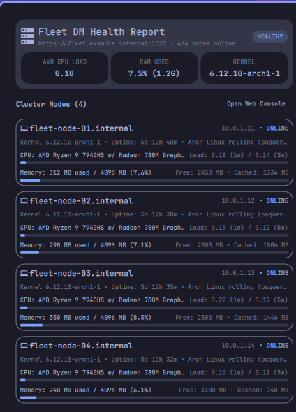

# Omarchy Fleet DM Health Plugin (`fleet.health`)

A bar widget and status panel for [Omarchy](https://github.com/omacom/omarchy) that connects to [Fleet DM](https://fleetdm.com/) to monitor cluster node health, live osquery telemetry, and swarm status.

<p align="center">
  
</p>

## Features

- **Status Bar Indicator (`󰒋`)**: Real-time cluster status badge in the top bar showing health state and alerting if any swarm nodes go offline.
- **Cluster Health Overview**:
  - Aggregate status badge (`HEALTHY` / `WARNING` / `DEGRADED`).
  - Average CPU load across cluster (1m).
  - Total and used cluster RAM with percentage bar.
  - Active kernel version across the swarm.
- **Live Node Telemetry Cards (osquery)**:
  - Live osquery metrics for all registered swarm nodes.
  - Hostname, primary IP, and online badge.
  - CPU model and 1m/5m load averages.
  - Memory consumption (Used, Free, Cached, Total) with visual memory bar.
  - Kernel version, boot arguments, and uptime.
  - Click any node card to copy its IP address to the clipboard.
- **Fleet Console Launcher**: One-click opening of the Fleet Web UI (`https://fleet.example.com:1337`).
- **Interactive Shortcuts**:
  - **Left-click** bar icon: Toggle panel.
  - **Middle-click** bar icon or press `o`: Open Fleet DM web console.
  - **Right-click** bar icon or press `r`: Force immediate telemetry refresh.
  - **Esc** or click outside: Close panel.

## How to Test

### 1. Test Telemetry Data via CLI
Run the report collector script directly to inspect the live JSON payload returned by Fleet's osquery query:
```bash
omarchy-fleet-health-report
```
Or run in demo mode to preview sanitized test telemetry:
```bash
omarchy-fleet-health-report --demo
```

### 2. Test Desktop UI via IPC
Toggle or open/close the popup panel directly from your terminal:
```bash
# Toggle panel on/off
omarchy-shell fleet.health toggle

# Explicit open / close / refresh
omarchy-shell fleet.health open
omarchy-shell fleet.health close
omarchy-shell fleet.health refresh
```

### 3. Test Bar Icon & Interaction (GUI)
- Locate the `󰒋` icon in the right section of the Omarchy top bar.
- **Click** it to open the Fleet DM Health panel.
- **Click any host card** in the list: it copies the node's IP to the clipboard and sends a desktop notification.
- **Click "Open Web Console"** (or press `o`): opens the Fleet server URL in your default browser.

### 4. Test inside a Cluster Container or Remote Node
The report script can run on any machine or container with `fleetctl` configured:
```bash
ssh user@node "omarchy-fleet-health-report"
```

## Installation & Configuration

Install with:
```bash
./install.sh
```

Ensure `fleet.health` is included in your bar widgets in `~/.config/omarchy/shell.json`:
```json
{
  "bar": {
    "layout": {
      "right": [
        "fleet.health",
        "omarchy.tray",
        "omarchy.clock"
      ]
    }
  }
}
```

