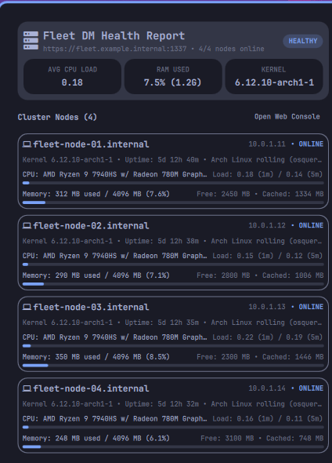

# Omarchy Fleet DM Health Plugin (`fleet.health`)

A bar widget and status panel for [Omarchy](https://github.com/omacom/omarchy) that connects to [Fleet DM](https://fleetdm.com/) to monitor cluster node health, live osquery telemetry, and swarm status.

<p align="center">
  
</p>

## Features

- **Status Bar Indicator (`󰒋`)**: Real-time cluster status badge in the top bar showing health state and alerting if any swarm nodes go offline.
- **Cluster Health Overview**:
  - Aggregate status badge (`HEALTHY` / `WARNING` / `DEGRADED`).
  - Average CPU load across cluster (1m).
  - Total and used cluster RAM with percentage bar.
  - Active kernel version across the swarm.
- **Live Node Telemetry Cards (osquery)**:
  - Live osquery metrics for all registered swarm nodes.
  - Hostname, primary IP, and online badge.
  - CPU model and 1m/5m load averages.
  - Memory consumption (Used, Free, Cached, Total) with visual memory bar.
  - Kernel version, boot arguments, and uptime.
  - Click any node card to copy its IP address to the clipboard.
- **Fleet Console Launcher**: One-click opening of the Fleet Web UI (`https://fleet.example.com:1337`).
- **Interactive Shortcuts**:
  - **Left-click** bar icon: Toggle panel.
  - **Middle-click** bar icon or press `o`: Open Fleet DM web console.
  - **Right-click** bar icon or press `r`: Force immediate telemetry refresh.
  - **Esc** or click outside: Close panel.

## How to Test

### 1. Test Telemetry Data via CLI
Run the report collector script directly to inspect the live JSON payload returned by Fleet's osquery query:
```bash
omarchy-fleet-health-report
```
Or run in demo mode to preview sanitized test telemetry:
```bash
omarchy-fleet-health-report --demo
```

### 2. Test Desktop UI via IPC
Toggle or open/close the popup panel directly from your terminal:
```bash
# Toggle panel on/off
omarchy-shell fleet.health toggle

# Explicit open / close / refresh
omarchy-shell fleet.health open
omarchy-shell fleet.health close
omarchy-shell fleet.health refresh
```

### 3. Test Bar Icon & Interaction (GUI)
- Locate the `󰒋` icon in the right section of the Omarchy top bar.
- **Click** it to open the Fleet DM Health panel.
- **Click any host card** in the list: it copies the node's IP to the clipboard and sends a desktop notification.
- **Click "Open Web Console"** (or press `o`): opens the Fleet server URL in your default browser.

### 4. Test inside a Cluster Container or Remote Node
The report script can run on any machine or container with `fleetctl` configured:
```bash
ssh user@node "omarchy-fleet-health-report"
```

## Requirements

- `python3` (report collector) and `jq` (`omarchy-fleet-status`)
- `fleetctl` configured against your Fleet DM server (otherwise the panel shows Disconnected; use `--demo` to preview)
- `wl-copy` for click-to-copy

No `sudo` is required; everything installs to user space.

## Data Handling & Limits

Everything returned by Fleet is treated as untrusted:

- `fleetctl` runs without a shell. Its stdout is read with a fixed byte budget (4 MiB), and the process is killed with a timeout. If output goes over the budget, collection fails closed and the panel shows an error instead of partial data.
- At most 250 hosts are collected, and lines over 64 KiB are skipped. The emitted report is capped at 2 MiB, and the panel re-checks both limits before parsing.
- Strings have control characters stripped and are length-capped. Numbers are range-checked, so `NaN`/`Infinity` never reach the JSON. Every dynamic `Text` in the panel uses `Text.PlainText`, so markup in hostnames or OS fields displays literally.
- Node IPs must match a strict allowlist before they can be copied. Clipboard and notification actions use argument-vector APIs, not shell strings.
- "Open Web Console" only opens `http://` or `https://` URLs.

## Installation & Configuration

Install with:
```bash
./install.sh
```
Helper scripts go to `~/.local/bin` (override with `PREFIX=...`; the panel expects `~/.local/bin`).

Ensure `fleet.health` is included in your bar widgets in `~/.config/omarchy/shell.json`:
```json
{
  "bar": {
    "layout": {
      "right": [
        "fleet.health",
        "omarchy.tray",
        "omarchy.clock"
      ]
    }
  }
}
```

## Removal

To completely remove the `fleet.health` plugin and its installed helper scripts:

```bash
./uninstall.sh
```

Then remove `"fleet.health"` from your bar layout in `~/.config/omarchy/shell.json` and reload or restart your Omarchy shell.

## License

[MIT License](LICENSE) — Copyright (c) 2026 szaidi-code.


